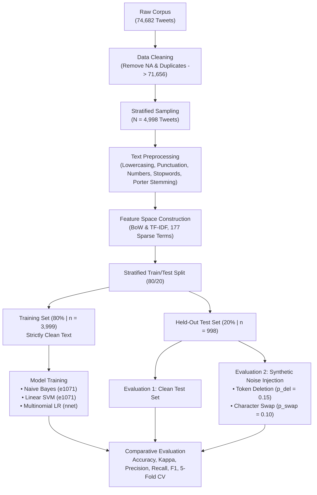

<div align="center">

# 📊 Noise-Robust Twitter Sentiment Classification in R

### A Reproducible Empirical Benchmark Evaluating Bag-of-Words vs. TF-IDF with Naive Bayes, Linear SVM, and Multinomial Logistic Regression under Synthetic Textual Corruption

[](https://www.r-project.org/)
[](https://posit.co/)
[](https://github.com/mhtamim136/r-twitter-sentiment-noise-robustness/blob/main/Paper/Classifier_Choice_Outweighs_Representation_Choice_for_Noise_Robust_Twitter_Sentiment_Classification__6_%20(1).pdf)
[](https://github.com/mhtamim136/r-twitter-sentiment-noise-robustness/blob/main/Paper/Classifier_Choice_Outweighs_Representation_Choice_for_Noise_Robust_Twitter_Sentiment_Classification__6_.zip)
[](https://www.aiub.edu/)

</div>

---

## 📌 Abstract & Overview

Social media text is routinely degraded by spelling errors, dropped words, slang, and typographical noise. While traditional Natural Language Processing (NLP) pipelines rely on **Bag-of-Words (BoW)** and **Term Frequency–Inverse Document Frequency (TF-IDF)** representations, their benchmark performance is almost exclusively reported on sanitized, clean datasets.

This project delivers a rigorous, reproducible empirical study investigating how classical representation-classifier pairings withstand controlled surface text corruption. Utilizing the **Twitter Entity Sentiment Analysis dataset** ($n = 4,998$ stratified sample across 4 sentiment classes), we evaluate 6 configurations combining two feature weighting schemes (BoW vs. TF-IDF) with three classical learning algorithms:
- **Multinomial Naive Bayes**
- **Linear Support Vector Machine (SVM)**
- **Multinomial Logistic Regression (MLR)**

To assess noise resilience without data leakage, models are trained strictly on clean text ($80\%$ split, $n = 3,999$), while controlled synthetic noise (random token deletion $p_{\text{del}}$ and adjacent-character transposition $p_{\text{swap}}$) is injected exclusively into the held-out test set ($20\%$ split, $n = 998$) over repeated independent trials.

📄 **Read the Paper:** [**Download IEEE Conference Paper (PDF)**](https://github.com/mhtamim136/r-twitter-sentiment-noise-robustness/blob/main/Paper/Classifier_Choice_Outweighs_Representation_Choice_for_Noise_Robust_Twitter_Sentiment_Classification__6_%20(1).pdf) &nbsp;|&nbsp; 📦 [**LaTeX Source & Figures (ZIP)**](https://github.com/mhtamim136/r-twitter-sentiment-noise-robustness/blob/main/Paper/Classifier_Choice_Outweighs_Representation_Choice_for_Noise_Robust_Twitter_Sentiment_Classification__6_.zip)

---

## 📋 Table of Contents

- [Key Scientific Takeaways](#-key-scientific-takeaways)
- [Visual Analytics & Paper Figures](#-visual-analytics--paper-figures)
- [Empirical Results & Benchmarks](#-empirical-results--benchmarks)
- [Experimental Methodology](#-experimental-methodology)
- [Dataset Characteristics](#-dataset-characteristics)
- [Project Structure](#-project-structure)
- [Quickstart: Running in RStudio](#-quickstart-running-in-rstudio)
- [Citation](#-citation)
- [Academic Credits & Research Team](#-academic-credits--research-team)
- [Author & Contact](#-author--contact)

---

## 💡 Key Scientific Takeaways

1. **Classifier Choice Dominates Representation Choice:**
   - For discriminative models (SVM and MLR), switching between BoW and TF-IDF altered clean accuracy by at most **$1.4$ percentage points**, and that gap reversed under cross-validation.
   - In contrast, classifier selection introduced performance gaps of **$10.3$ to $18.1$ percentage points**. The feature weighting scheme is therefore a *second-order* design decision, while classifier architecture is the *first-order* factor.
2. **Multinomial Logistic Regression Achieves Peak Robustness:**
   - **MLR + BoW** achieved the highest clean accuracy (**$46.89\%$**, $\kappa = 0.2754$) and suffered only a minor $2.40\%$ drop under moderate noise (**$44.49\%$**, $\kappa = 0.2423$).
3. **Catastrophic Failure of Naive Bayes under Corrupted TF-IDF:**
   - When paired with noisy TF-IDF features, Naive Bayes performance plummeted to **$26.45\%$** ($\kappa = 0.0458$), falling significantly below the majority-class baseline (**$30.26\%$**).
4. **Generalization Verified via 5-Fold Cross-Validation:**
   - 5-fold CV proved that MLR ($47.52\%$ mean) and Linear SVM ($46.46\%$ mean) consistently outperform Naive Bayes across every single fold without exception.

---

## 📸 Visual Analytics & Paper Figures

### Confusion Matrix & Cross-Validation Analysis

| Best Model Confusion Matrix (`MLR + BoW`) | 5-Fold Cross-Validation Performance Across Models |
|:---:|:---:|
|  |  |
| *Rows: Predictions, Columns: Ground Truth. Diagonal elements highlight robust classification of Negative and Positive classes.* | *Per-fold clean accuracy compared against the 30.26% majority baseline (dashed). MLR and SVM consistently lead across all folds.* |

### Corpus Lexicon & Class Distribution

| Vocabulary Distribution (Masked Word Cloud) | Stratified Class Balance |
|:---:|:---:|
|  |  |
| *Most frequent terms in the 177-term BoW feature space after stopword removal and Porter stemming.* | *Clean four-class breakdown: Negative (30.3%), Positive (27.6%), Neutral (24.8%), Irrelevant (17.4%).* |

---

## 📊 Empirical Results & Benchmarks

### 1. Overall Clean vs. Noisy Performance Comparison

Evaluated on the held-out test set ($n = 998$ tweets) with majority-class baseline of **$30.26\%$**:

| Representation | Classifier | Condition | Accuracy (%) | Cohen's Kappa ($\kappa$) | Performance vs. Baseline | Noise Degradation ($\Delta$) |
|---|---|:---:|:---:|:---:|:---:|:---:|
| **BoW** | **Multinomial LR** | **Clean** | **46.89%** | **0.2754** | $+16.63\%$ | — |
| **BoW** | **Multinomial LR** | **Noisy** | **44.49%** | **0.2423** | $+14.23\%$ | $-2.40\%$ |
| **BoW** | **Linear SVM** | Clean | 45.49% | 0.2590 | $+15.23\%$ | — |
| **BoW** | **Linear SVM** | Noisy | 43.09% | 0.2275 | $+12.83\%$ | $-2.40\%$ |
| **BoW** | **Naive Bayes** | Clean | 36.57% | 0.1906 | $+6.31\%$ | — |
| **BoW** | **Naive Bayes** | Noisy | 32.67% | 0.1485 | $+2.41\%$ | $-3.90\%$ |
| **TF-IDF** | **Multinomial LR** | Clean | 45.59% | 0.2603 | $+15.33\%$ | — |
| **TF-IDF** | **Multinomial LR** | **Noisy** | **44.59%** | **0.2449** | $+14.33\%$ | **$-1.00\%$** |
| **TF-IDF** | **Linear SVM** | **Clean** | **46.59%** | **0.2757** | $+16.33\%$ | — |
| **TF-IDF** | **Linear SVM** | Noisy | 43.39% | 0.2297 | $+13.13\%$ | $-3.20\%$ |
| **TF-IDF** | **Naive Bayes** | Clean | 32.57% | 0.1354 | $+2.31\%$ | — |
| **TF-IDF** | **Naive Bayes** | Noisy | 26.45% | 0.0458 | **$-3.81\%$** ⚠️ | **$-6.12\%$** |

> ⚠️ *Note: Naive Bayes on noisy TF-IDF drops below the 30.26% majority class baseline, indicating complete collapse under textual perturbation.*

---

### 2. 5-Fold Cross-Validation Breakdown (Clean Data)

| Feature Space | Classifier | Fold 1 | Fold 2 | Fold 3 | Fold 4 | Fold 5 | Mean Accuracy | Std. Dev (SD) |
|---|---|:---:|:---:|:---:|:---:|:---:|:---:|:---:|
| **TF-IDF** | **Multinomial LR** | 47.15% | **49.40%** | 47.30% | 46.60% | 47.15% | **47.52%** | $\pm 0.0108$ |
| **TF-IDF** | **Linear SVM** | 46.05% | 47.10% | 46.10% | 45.60% | 47.45% | **46.46%** | $\pm 0.0078$ |
| **BoW** | **Multinomial LR** | 44.55% | 48.20% | 45.90% | 46.40% | 45.55% | **46.12%** | $\pm 0.0135$ |
| **BoW** | **Linear SVM** | 45.65% | 46.30% | 45.90% | 44.00% | 45.55% | **45.48%** | $\pm 0.0088$ |
| **BoW** | **Naive Bayes** | 37.04% | 37.50% | 34.10% | 33.30% | 35.94% | **35.57%** | $\pm 0.0183$ |
| **TF-IDF** | **Naive Bayes** | 32.93% | 31.90% | 31.00% | 29.60% | 31.23% | **31.33%** | $\pm 0.0123$ |

---

### 3. Confusion Matrix: Best Model (`Multinomial LR + BoW`, Clean Test Set)

```
                       Actual Class
Predicted        Irrelevant   Negative   Neutral   Positive   Total Pred
------------------------------------------------------------------------
Irrelevant          48          18        18         25          109
Negative            47         164        60         48          319
Neutral             26          44       100         46          216
Positive            53          76        69        156          354
------------------------------------------------------------------------
Actual Total       174         302       247        275          998
```

---

## 🔬 Experimental Methodology



### Noise Injection Mechanics
To test real-world social media volatility without corrupting training data, noise was introduced only to the test partition:
- **Random Token Deletion ($p_{\text{del}}$):** Drops words with probability $p_{\text{del}} \in \{0.10, 0.20, 0.30\}$ (standard benchmark at $0.15$).
- **Character Transposition ($p_{\text{swap}}$):** Simulates typographical errors by swapping adjacent characters with probability $0.10$ on tokens longer than 3 characters.
- **Monte Carlo Repetitions:** 5 independent random seeds per condition to prevent single-sample distortion.

---

## 📁 Project Structure

```
r-twitter-sentiment-noise-robustness/
│
├── Code/                                       # R Project & Analysis Code
│   ├── Data_Science_final_Project.Rproj       # RStudio project file (Double-click to open)
│   └── analysis.R                             # Full reproducible R pipeline (EDA, NLP, Modeling, CV)
│
├── DataSet/                                    # Raw Dataset
│   └── twitter_training.csv                   # Twitter Entity Sentiment Analysis dataset (~10.2 MB)
│
├── Outputs/                                    # Generated Artifacts & Visualizations
│   ├── images/                                # High-resolution exploratory plots
│   │   ├── fig1_class_distribution.png        # Bar chart of sentiment class breakdown
│   │   ├── fig_wordcloud_v5_masked.png        # Vocabulary cloud representation
│   │   ├── output images from r code.docx     # Consolidated graphics report
│   │   └── 1.png ... 10.png                   # Individual intermediate diagnostic plots
│   └── paper_outputs/                         # Publication-grade figures and metrics
│       ├── cm_best_MLR_BoW_clean.csv          # Confusion matrix data of top performing model
│       ├── fig_confusion_matrix.png           # Heatmap representation of prediction distribution
│       ├── fig_cv_perfold.png                 # Cross-validation bar graph across all 5 folds
│       ├── fig_wordcloud_v5_masked.png        # Paper word cloud figure
│       ├── table_cv_perfold_wide.csv          # 5-fold CV accuracy per fold table
│       ├── table_overall_metrics.csv          # Clean vs. noisy summary table
│       └── table_perclass_metrics.csv         # Precision, Recall, F1 per sentiment class
│
├── Paper/                                      # Scientific Paper & Documentation
│   ├── Classifier_Choice_...__6_ (1).pdf      # Formatted camera-ready IEEE conference paper PDF
│   └── Classifier_Choice_...__6_.zip          # Complete LaTeX source bundle (main.tex, bib, figures)
│
└── README.md                                  # Repository documentation
```

---

## 🚀 Quickstart: Running in RStudio

### 1. Prerequisites

Ensure you have **R (>= 4.2.0)** and **RStudio** installed. Install the necessary CRAN libraries:

```R
install.packages(c(
  "tidyverse",    # Data manipulation and visualization (ggplot2, dplyr)
  "tm",           # Text mining and corpus preprocessing
  "caret",        # Data partitioning and cross-validation
  "SnowballC",    # Porter stemming algorithm
  "e1071",        # Naive Bayes and Support Vector Machine
  "nnet",         # Multinomial Logistic Regression
  "wordcloud"     # Lexicon word cloud generation
))
```

### 2. Launching via RStudio Project

1. Clone the repository:
   ```bash
   git clone https://github.com/mhtamim136/r-twitter-sentiment-noise-robustness.git
   ```
2. Navigate to the `Code/` directory and open:
   ```
   Code/Data_Science_final_Project.Rproj
   ```
   > 💡 *Opening `Data_Science_final_Project.Rproj` automatically launches RStudio and configures the working directory directly to the project root.*
3. Open `Code/analysis.R` and run the script step-by-step or execute:
   ```R
   source("Code/analysis.R")
   ```

---

## 📖 Citation

If you use this codebase, methodology, or dataset benchmark in your research, please cite our conference paper:

```bibtex
@inproceedings{hasan2026classifier,
  author    = {Md. Murad Hasan and Mahbuba Nasrin and Najiat Islam Rishad and Atia Chowdhury and Kamrun Naher Koli},
  title     = {Classifier Choice Outweighs Representation Choice for Noise-Robust Twitter Sentiment Classification},
  booktitle = {Proceedings of the International Conference on Computing, Electronics and Communications Engineering},
  year      = {2026},
  publisher = {IEEE},
  address   = {Dhaka, Bangladesh}
}
```

---

## 👥 Academic Credits & Research Team

This research project was carried out under the **Department of Computer Science and Engineering (CSE)** at **American International University-Bangladesh (AIUB)**.

### Authors & Affiliations:
| Researcher | Student / Faculty ID | Role | Department / Affiliation |
|---|:---:|:---:|---|
| **Md. Murad Hasan** *(Lead Author)* | `23-55559-3` | Research Lead & Implementation | Dept. of CSE, AIUB |
| **Mahbuba Nasrin** | `23-54976-3` | Author & Data Analyst | Dept. of CSE, AIUB |
| **Najiat Islam Rishad** | `23-55218-3` | Author & Methodology | Dept. of CSE, AIUB |
| **Atia Chowdhury** | `23-52252-2` | Author & Literature Survey | Dept. of CSE, AIUB |
| **Kamrun Naher Koli** | `Faculty` | Research Supervisor & Advisor | Assistant Professor, Dept. of CSE, AIUB |

---

## 👨‍💻 Author & Contact

<div align="center">

### Murad Hasan Tamim

*Computer Science & Engineering Student | Data Science & Machine Learning Researcher*

[](https://mhtamim136.github.io)
[](https://mhtamim136.github.io/profile-card/)
[](https://github.com/mhtamim136)

> 💬 Interested in collaborating on NLP, text robustness, or machine learning pipelines? Feel free to reach out through my portfolio website!

</div>

---

<div align="center">

⭐ **If you found this research benchmark or codebase helpful, please consider giving the repository a star!** ⭐

</div>
